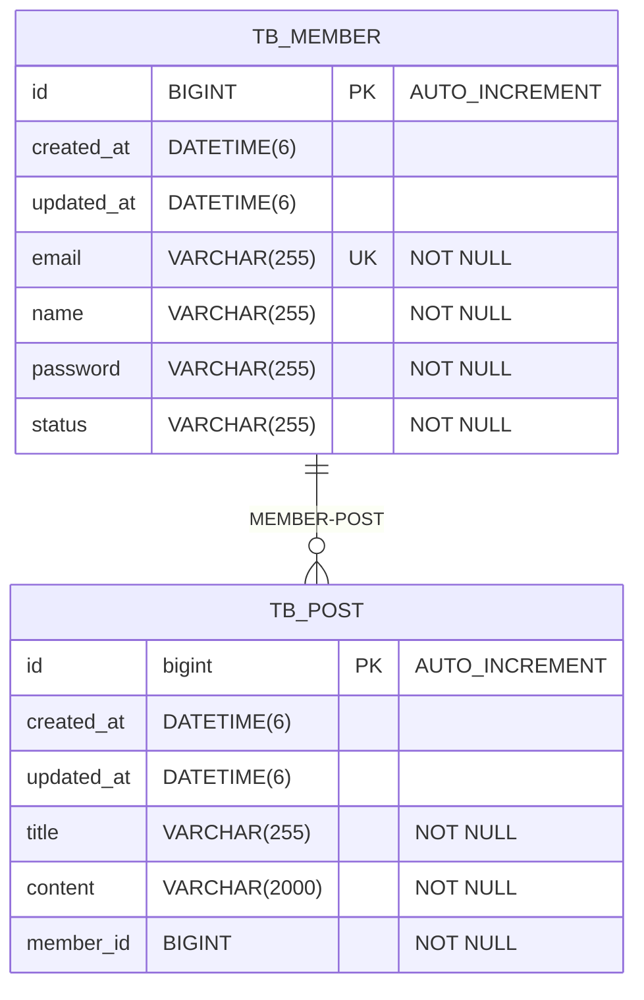

# 원티드 프리온보딩 백엔드 인턴십 - 선발 과제

 
 

### 지원자의 성명

- 이기덕

### 애플리케이션의 실행 방법 (엔드포인트 호출 방법 포함)

로컬환경에서 실행

- POST : localhost:8181/api/members/signin : 로그인
- POST : localhost:8181/api/members/signup : 회원가입
- GET : localhost:8181/api/posts/list : 게시판 전체 조회
- GET : localhost:8181/api/posts/{idx} : 특정 게시판 조회
- POST : localhost:8181/api/posts : 게시판 작성
- DELETE : localhost:8181/api/posts/{id} : 특정 게시판 삭제
- PUT : localhost:8181/api/posts : 특정 게시판 수정

### 데이터베이스 테이블 구조

### 구현한 API의 동작을 촬영한 데모 영상 링크

https://github.com/lkdcode/wanted-pre-onboarding-backend/assets/110602069/ca3133b5-cd90-48d3-9d13-b5acab7e950c

### 구현 방법 및 이유에 대한 간략한 설명

- 회원가입
    - 이름, 이메일, 비밀번호를 입력하여 회원가입을 한다.
    - 이메일은 중복을 허용하지 않고 이메일 양식을 따른다.
    - 비밀번호는 8자 이상으로 암호화되어 저장한다.
- 로그인
    - 이메일, 비밀번호를 입력하여 로그인을 한다.
    - 이메일 혹은 비밀번호가 일치하지 않을 경우 클라이언트에게 메시지 전달을 한다.
    - 보안상 이유로 존재하지 않는 회원인지, 비밀번호가 틀린건지 정확하게 알려주지 않는다.
    - 로그인에 성공할 경우 토큰을 발급한다.
- 게시글 전체 조회
    - 토큰 유효성 검사 후 게시글을 조회한다.
- 게시글 작성
    - 토큰 유효성 검사 후 게시글을 작성한다.
- 게시글 삭제
    - 토큰 유효성 검사 후 현재 게시글의 작성자와 일치할 경우 삭제한다.
- 게시글 수정
    - 토큰 유효성 검사 후 현재 게시글의 작성자와 일치할 경우 수정한다.
- Jwt
    - 로그인에 성공한 회원에게만 토큰을 발급한다.
    - 요청이 오기전 필터에서 유효성 검사를 진행하고 컨트롤러에서 사용할 정보를 넘겨준다.

### API 명세(request/response 포함)

- POST : localhost:8181/api/members/signin : 로그인
    - request : String email, String rawPassword
    - response : String token
- POST : localhost:8181/api/members/signup : 회원가입
    - request : String name, String email, String rawPassword
    - response : boolean success
- GET : localhost:8181/api/posts/list : 게시판 전체 조회
    - request : Pagealbe pageable
    - response : List`<PostResponseDTO>` list
- GET : localhost:8181/api/posts/{idx} : 특정 게시판 조회
    - request : Long id
    - response : Long id, String title, String content, String name, Instant createdAt, Instant updatedAt
- POST : localhost:8181/api/posts : 게시판 작성
    - request : String title, String content, CustomUserDetails userDetails
    - response : Boolean success
- DELETE : localhost:8181/api/posts/{id} : 특정 게시판 삭제
    - request : Long id, CustomUserDetails userDetails
    - response : Boolean success
- PUT : localhost:8181/api/posts : 특정 게시판 수정
    - request : Long postId, String updateTitle, String updateContent, CustomUserDetails userDetails
    - response : Boolean success

### 가산점

- 요구사항에 맞게 API를 만든 후에 아래의 기능을 추가할 경우 가산점이 주어집니다.
    - 통합 테스트 또는 단위 테스트 코드를 추가한 경우
    - docker compose를 이용하여 애플리케이션 환경을 구성한 경우 (README.md 파일에 docker-compose 실행 방법 반드시 기입)
    - 클라우드 환경(AWS, GCP)에 배포 환경을 설계하고 애플리케이션을 배포한 경우 (README.md 파일에 배포된 API 주소와 설계한 AWS 환경 그림으로 첨부)

### docker compose를 이용하여 애플리케이션 환경을 구성한 경우 (README.md 파일에 docker-compose 실행 방법 반드시 기입)

- Terminal : `docker-compose up -d`
